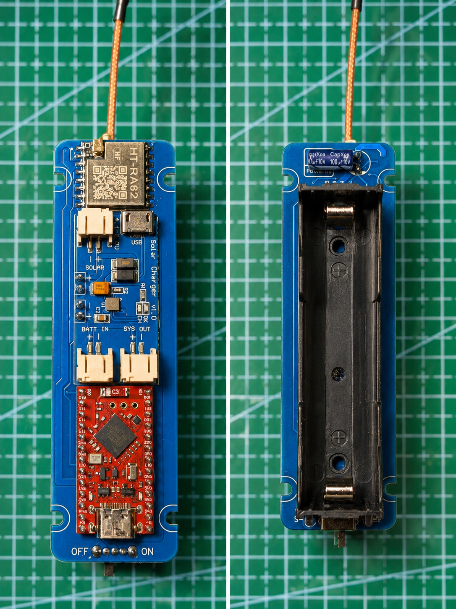

# cheap-mesh-node 🌞

An ultra-low-cost, compact and highly efficient solar-powered node for **Meshtastic**, **LoRa**, **MeshCore**, and similar mesh networking systems.

Special thanks to **FakeTec** for the inspiration behind this project. 🤎

This design is heavily based on:
- [FakeTec PCB project](https://github.com/gargomoma/fakeTec_pcb) by Gargomoma
- [Shimon Horanek's FakeTec v5 schematic](https://github.com/gargomoma/fakeTec_pcb/blob/main/design_files/ShimonHoranek_fakeTecv5schematics.pdf)

---

# Features

- **Module-based design**  
  No micro-soldering and no need to source dozens of tiny components. Everything is built using inexpensive, readily available modules from AliExpress.

- **Extremely affordable**  
  Less than 30€, inluding NRF52, BMS, battery, solar mppt and solar panel. Plus other 20€ or less on a decent antenna. (Or DIY a **ground plane antenna** for free)
  
- **MPPT solar charging + BMS protection**  
  Efficient charging even on cloudy days, with battery over-discharge protection. Connect solar pannel directly to S+ and S- pads.

- **nRF52840-based**  
  Extremely low power consumption. Even with limited sunlight, the node can operate for weeks without issues.

- **Excellent range**  
  Tested at over **200 km line-of-sight**, thanks to the HT-RA62 LoRa module.

- **Open hardware**  
  PCB files, schematics, and design sources are fully available for inspection, modification, and redistribution.

---

## How to build
- [Buy components](https://github.com/mosstrike/cheap-mesh-node/wiki/Buy)
- [Order PCB](https://github.com/mosstrike/cheap-mesh-node/wiki/OrderPCB)
- [Flashing NRF52](https://github.com/mosstrike/cheap-mesh-node/wiki/Flashing)  
- [Assembly](https://github.com/mosstrike/cheap-mesh-node/wiki/Assembly)
